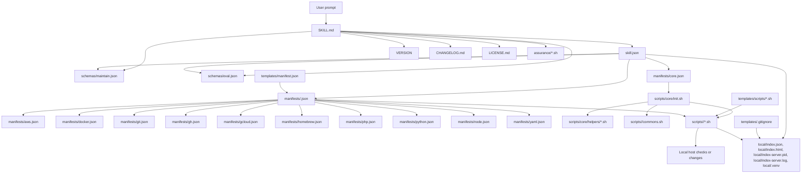

# Skill: Blackhost

## Architecture

Blackhost is a skill-level host setup harness, created by Blackaft Associates.

- `SKILL.md` is the instruction entrypoint.
- `skill.json` is the lightweight index.
- `VERSION` is the skill release version.
- `CHANGELOG.md` is the one-line release log; each row records Version, User, LLM, and a 240-character summary.
- `LICENSE.md` is the PolyForm Shield license with the required Blackaft notice.
- `schemas/maintain.json` defines the deterministic skill maintenance process.
- `schemas/eval.json` defines deterministic agent checks.
- `assurance/*.sh` runs executable assurance checks.
- `local/index.json`, `local/index.html`, `local/index-server.pid`, `local/index-server.log`, and `local/.venv` are generated local state artifacts; `local/index.html` includes raw `assurance/log.txt` output at the bottom.
- `manifests/*.json` define package contracts.
- `templates/.gitignore` declares generated blackhost artifacts for copied skill installations.
- `scripts/core/init.sh` is the only public CLI entrypoint.



## Maintenance

When adding or changing a package or public command, read `schemas/maintain.json` and follow its ordered maintenance process. Update `VERSION` and add a matching `CHANGELOG.md` row for behavior, public capability, routing, schema, template, assurance, licensing, or generated-state contract changes. Before completion, run `assurance/eval.sh`.

## Capabilities

- CLI entrypoint: `scripts/core/init.sh`
- Manifest root: `manifests/`

Meta prompts are natural-language invocations that agents should map to the canonical command surface before execution.

| Capability | Meta Prompt | Command | Manifest | Mutates host |
| --- | --- | --- | --- | --- |
| Help | `blackhost help` | `--help` | `core.json` | No |
| OS detection | `blackhost detect os` | `os` | `core.json` | No |
| AWS CLI readiness | `blackhost check aws` | `aws check` | `aws.json` | No |
| AWS CLI SSO browser auth | `blackhost auth aws` | `aws auth` | `aws.json` | Yes, mutates AWS CLI SSO credential state; supports `--dry-run` |
| AWS CLI installation | `blackhost install aws` | `aws install` | `aws.json` | Yes, prompts unless `--yes`; supports `--dry-run` |
| AWS CLI update | `blackhost update aws` | `aws update` | `aws.json` | Yes, prompts unless `--yes`; supports `--dry-run` |
| Docker readiness | `blackhost check docker` | `docker check` | `docker.json` | No, except Docker may pull and run `hello-world` when the daemon is reachable |
| Docker app scaffold | `blackhost dockerise app` | `docker dockerise <target-dir>` | `docker.json` | No host mutation; may write Docker files inside the target workspace directory |
| Docker local app run | `blackhost run docker app` | `docker run <target-dir>` | `docker.json` | Yes, builds/runs local Docker containers; supports `--dry-run` |
| Docker installation | `blackhost install docker` | `docker install` | `docker.json` | Yes, prompts unless `--yes`; supports `--dry-run` |
| Docker update | `blackhost update docker` | `docker update` | `docker.json` | Yes, prompts unless `--yes`; supports `--dry-run` |
| Homebrew readiness | `blackhost check homebrew` | `homebrew check` | `homebrew.json` | No |
| Homebrew installation | `blackhost install homebrew` | `homebrew install` | `homebrew.json` | Yes, prompts unless `--yes`; supports `--dry-run` |
| Homebrew update | `blackhost update homebrew` | `homebrew update` | `homebrew.json` | Yes, prompts unless `--yes`; supports `--dry-run` |
| Git readiness | `blackhost check git` | `git check` | `git.json` | No |
| Git installation | `blackhost install git` | `git install` | `git.json` | Yes, prompts unless `--yes`; supports `--dry-run` |
| Git update | `blackhost update git` | `git update` | `git.json` | Yes, prompts unless `--yes`; supports `--dry-run` |
| GitHub CLI readiness | `blackhost check gh` | `gh check` | `gh.json` | No |
| GitHub CLI browser auth | `blackhost auth gh` | `gh auth` | `gh.json` | Yes, mutates GitHub CLI credential state; supports `--dry-run` |
| GitHub CLI installation | `blackhost install gh` | `gh install` | `gh.json` | Yes, prompts unless `--yes`; supports `--dry-run` |
| GitHub CLI update | `blackhost update gh` | `gh update` | `gh.json` | Yes, prompts unless `--yes`; supports `--dry-run` |
| Google Cloud CLI readiness | `blackhost check gcloud` | `gcloud check` | `gcloud.json` | No |
| Google Cloud CLI browser auth | `blackhost auth gcloud` | `gcloud auth` | `gcloud.json` | Yes, mutates gcloud credential state; supports `--dry-run` |
| Google Cloud CLI installation | `blackhost install gcloud` | `gcloud install` | `gcloud.json` | Yes, prompts unless `--yes`; supports `--dry-run` |
| Google Cloud CLI update | `blackhost update gcloud` | `gcloud update` | `gcloud.json` | Yes, prompts unless `--yes`; supports `--dry-run` |
| PHP and Composer readiness | `blackhost check php` | `php check` | `php.json` | No |
| PHP local app run | `blackhost run php app` | `php run <target-dir>` | `php.json` | Yes, starts a local PHP server process; supports `--dry-run` |
| PHP and Composer installation | `blackhost install php` | `php install` | `php.json` | Yes, prompts unless `--yes`; supports `--dry-run` |
| PHP and Composer update | `blackhost update php` | `php update` | `php.json` | Yes, prompts unless `--yes`; supports `--dry-run` |
| Python and pip readiness | `blackhost check python` | `python check` | `python.json` | No |
| Python static app run | `blackhost run python app` | `python run <target-dir>` | `python.json` | Yes, starts a local Python HTTP server process; supports `--dry-run` |
| Python and pip installation | `blackhost install python` | `python install` | `python.json` | Yes, prompts unless `--yes`; supports `--dry-run` |
| Python and pip update | `blackhost update python` | `python update` | `python.json` | Yes, prompts unless `--yes`; supports `--dry-run` |
| Node.js, npm, and npx readiness | `blackhost check node` | `node check` | `node.json` | No |
| Node.js local app run | `blackhost run node app` | `node run <target-dir>` | `node.json` | Yes, starts a local npm script process; supports `--dry-run` |
| Node.js installation | `blackhost install node` | `node install` | `node.json` | Yes, prompts unless `--yes`; supports `--dry-run` |
| Node.js update | `blackhost update node` | `node update` | `node.json` | Yes, prompts unless `--yes`; supports `--dry-run` |
| YAML and PyYAML readiness | `blackhost check yaml` | `yaml check` | `yaml.json` | No |
| YAML parse run | `blackhost parse yaml file` | `yaml run <yaml-file>` | `yaml.json` | No |
| PyYAML installation | `blackhost install yaml` | `yaml install` | `yaml.json` | Yes, prompts unless `--yes`; supports `--dry-run` |
| PyYAML update | `blackhost update yaml` | `yaml update` | `yaml.json` | Yes, prompts unless `--yes`; supports `--dry-run` |

## Usage

If the user only prompted `blackhost`, present the list of capabilities and, based on the current workspace/session context, `local/index.json` state when available, and this skill's list of capabilities, additionally summarise and present:

- Suggestions on what to use
- Follow-up questions to figure out how to use

If the user moves past simply the presentation of the prompting interface, load `skill.json` to ingest its lightweight manifest of capabilities and system instructions. Factor the manifest into your reasoning and then continue.

When available, inspect `local/index.json` before rerunning dependency checks; it records the latest observed local tool state and command output. Treat it as a cache, not proof that the host is still unchanged.

Every routed command refreshes `local/index.json` and `local/index.html`, starts or reuses the local status server, and triggers the system default browser for `http://localhost:8765/index.html`. This applies to local environment checks, installs, updates, auth commands, run commands, root help, package help, and OS detection. Assurance scripts set `BLACKHOST_OPEN_INDEX=false` so automated checks do not open repeated browser tabs.

When visually reviewing `local/index.html` outside a routed blackhost command, serve `local/` over localhost and open the HTTP URL in the system default browser. Do not rely on direct `file://` navigation or the Codex in-app browser for this local file review. A safe review server command is:

```bash
python3 -m http.server 8765 --bind 127.0.0.1 --directory .agents/skills/blackhost/local
```

Then trigger the system default browser:

```bash
python3 -m webbrowser http://localhost:8765/index.html
```

Stop the server when the review is complete.

For package-specific work, load the relevant manifest under `manifests/` before editing or executing scripts. Prefer the manifest-declared command surface over filesystem guessing.
